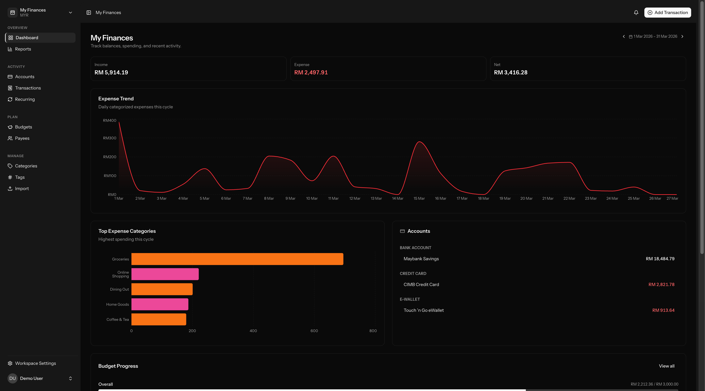
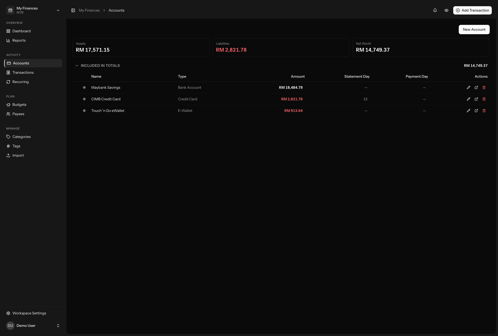
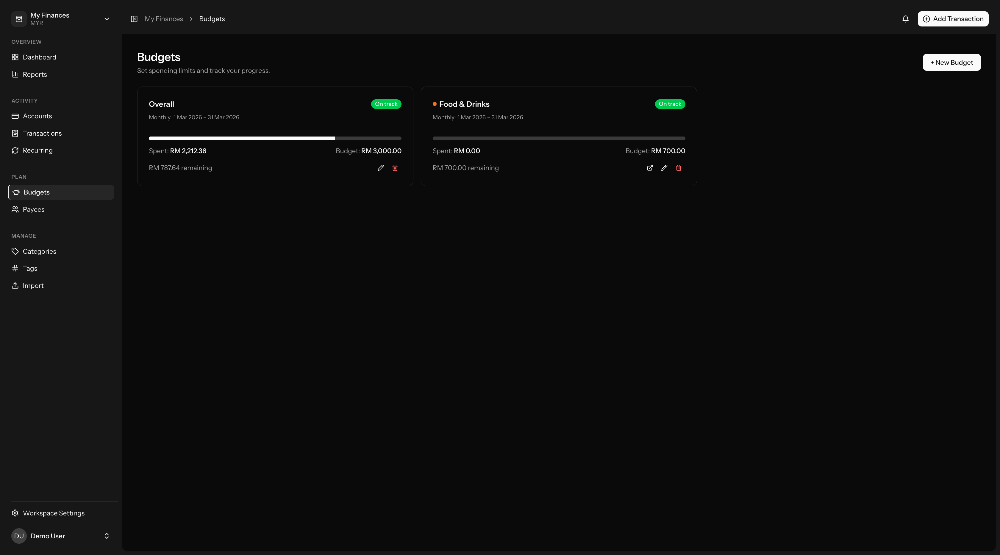
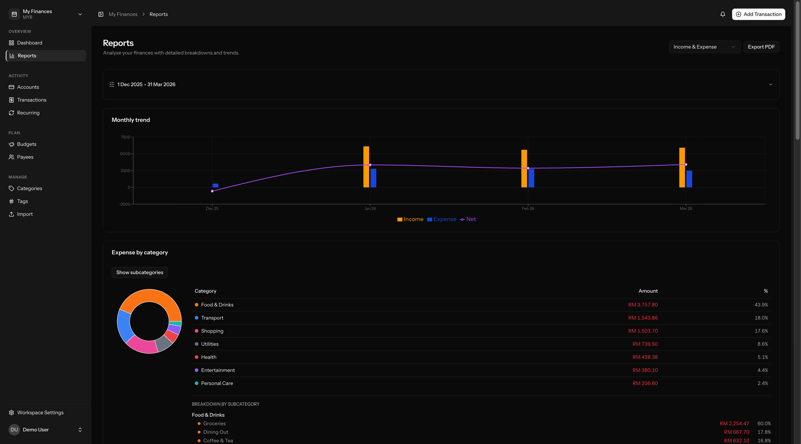

# Feenans

**Your finances. Your rules. Nobody watching.**

A self-hosted personal finance tracker for people who refuse to hand their financial data to corporations. Track spending, set budgets, monitor bills, and generate reports -- all on your own infrastructure where nobody else can touch your data.

No telemetry. No ads. No admin access to user financial data. Just a finance app that does its job.

---

## Features

- **Multi-account tracking** -- Checking, savings, credit cards, e-wallets, cash with real-time balances and net worth
- **Transactions** -- Income, expenses, transfers with splits, attachments, bulk operations, and CSV bank import
- **Categories and tags** -- Hierarchical categories with icons, color-coded tags, payee management
- **Budgets** -- Per-category spending limits with rollover, progress tracking, and threshold alerts
- **Recurring bills** -- Auto-generates transactions on schedule, flags missed payments, sends reminders
- **Reports** -- Income/expense trends, financial health, cash flow, budget performance with PDF export
- **Multi-workspace** -- Separate ledgers for personal, family, or project finances
- **Privacy mode** -- One toggle masks all amounts across the UI
- **2FA** -- TOTP-based two-factor authentication with recovery codes
- **Audit trail** -- Full change history with before/after diffs
- **Dark mode** -- Dark, light, and system theme support
- **Mobile-first** -- Designed for phones, enhanced for desktop

---

## Screenshots

<p>
  <picture>
    <source media="(prefers-color-scheme: dark)" srcset="public/screenshots/dashboard.png">
    <source media="(prefers-color-scheme: light)" srcset="public/screenshots/dashboard-light.png">
    
  </picture>
</p>

<p>
  <picture>
    <source media="(prefers-color-scheme: dark)" srcset="public/screenshots/account.png">
    <source media="(prefers-color-scheme: light)" srcset="public/screenshots/account-light.png">
    
  </picture>
</p>

<p>
  <picture>
    <source media="(prefers-color-scheme: dark)" srcset="public/screenshots/budget.png">
    <source media="(prefers-color-scheme: light)" srcset="public/screenshots/budget-light.png">
    
  </picture>
</p>

<p>
  <picture>
    <source media="(prefers-color-scheme: dark)" srcset="public/screenshots/report.png">
    <source media="(prefers-color-scheme: light)" srcset="public/screenshots/report-light.png">
    
  </picture>
</p>

---

## Getting Started

### Docker Compose (Recommended)

```bash
git clone https://github.com/firdausnasir/feenans.git
cd feenans
cp .env.example .env
docker compose up -d
```

The app will be available at `http://localhost:8080`. This starts the application, a queue worker, a task scheduler, and Redis.

For production, update your `.env`:

```env
APP_ENV=production
APP_DEBUG=false
APP_URL=https://your-domain.com
CACHE_STORE=redis
SESSION_DRIVER=redis
QUEUE_CONNECTION=redis

# Mail (required for bill reminders and password resets)
MAIL_MAILER=smtp
MAIL_HOST=smtp.example.com
MAIL_PORT=587
MAIL_USERNAME=your-username
MAIL_PASSWORD=your-password
MAIL_FROM_ADDRESS=noreply@your-domain.com
```

### Manual Setup

**Prerequisites:** PHP 8.2+, Composer 2, Node.js 22, SQLite

```bash
git clone https://github.com/firdausnasir/feenans.git
cd feenans
composer setup
composer dev
```

`composer setup` installs dependencies, configures the environment, runs migrations, and builds frontend assets. `composer dev` starts the dev server at `http://localhost:8000`.

---

## License

[GNU General Public License v3.0](LICENSE)
